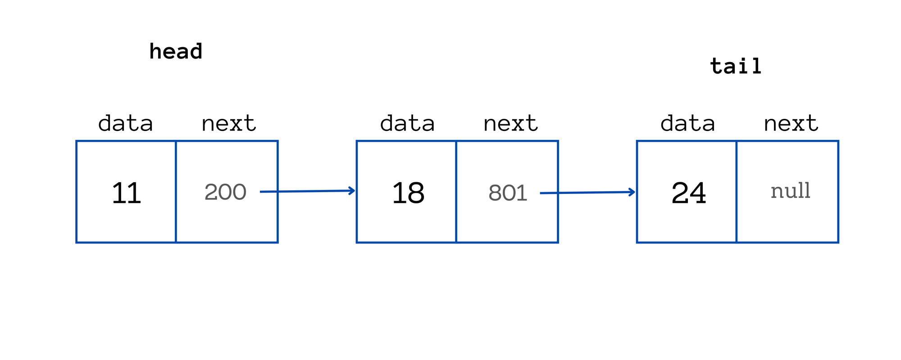

<h1 align="center"> Linked List, in Go </h1>

<p align="center">
  
</p>

<p align="center">
  
  
  
</p>

As you know generics will come to go 1.18 and one of the major drawbacks in go was implementing data structure
because of the lack of generics.
I implemented a small generic linked list in go and I think we can start having brand new data structures in Go.

## ~gotip~

First of all you need to install the master version of golang
and for this you can use `gotip`.

```sh
go install golang.org/dl/gotip@latest
gotip download
```

then you can use the `gotip` command as your normal `go` command.

## Examples

```go
func main() {
        l := list.New[int]()

        l.PushFront(10)
        l.PushFront(20)
        l.PushFront(40)

        fmt.Println(l)
}
```

```go
func main() {
        l := list.New[string]()

        l.PushFront("hello")

        fmt.Println(l)
}
```

```go
func main() {
        l := list.New[int]()

        l.PushFront(10)
        l.PushFront(20)
        l.PushFront(40)
        l.PushFront(42)

        fmt.Println(l)

        s := l.Filter(func(i int) bool {
                return i%10 == 0
        })

        fmt.Println(s)
}
```

## Generic methods (Go 1.27)

Go 1.27 lets methods declare their own type parameters. Previously a transform that
changed the element type had to be a standalone function, because a method could
only use the receiver's type parameters. `Map` now lives on `*List[T]` and carries
its own `U`:

```go
func (l *List[T]) Map[U any](fn func(T) U) iter.Seq[U] {
        return func(yield func(U) bool) {
                for value := range l.Values() {
                        if !yield(fn(value)) {
                                return
                        }
                }
        }
}
```

```go
func main() {
        l := list.New[int]()

        l.PushBack(1)
        l.PushBack(2)
        l.PushBack(3)

        // int -> string, all off the method — no free function needed.
        labels := slices.Collect(l.Map(func(i int) string {
                return fmt.Sprintf("#%d", i)
        }))

        fmt.Println(labels) // [#1 #2 #3]
}
```

## Related Issues

- <https://github.com/golang/go/issues/47896>
- <https://github.com/golang/go/issues/49085> — generic methods
